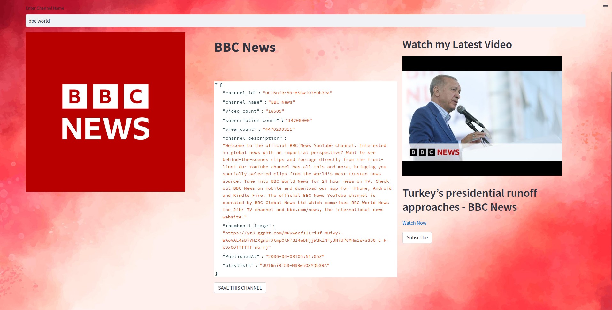
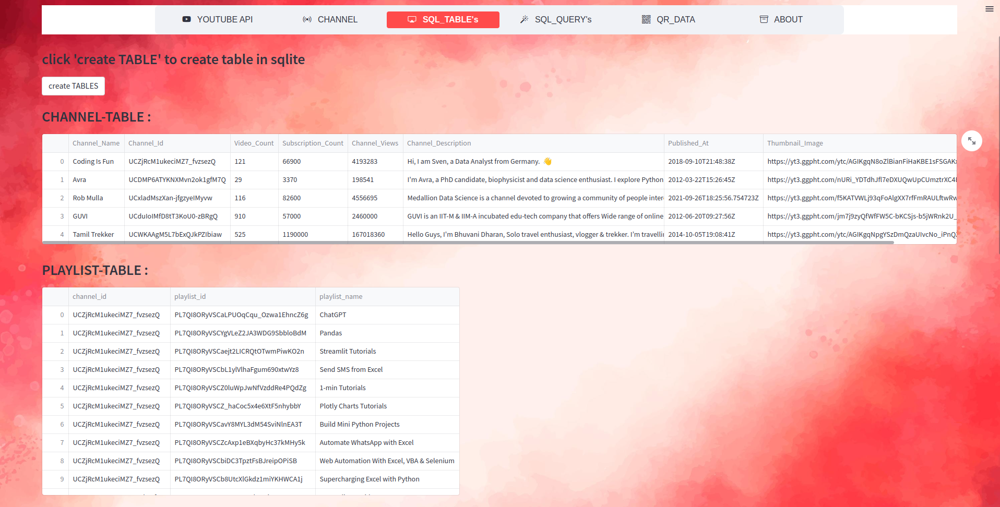
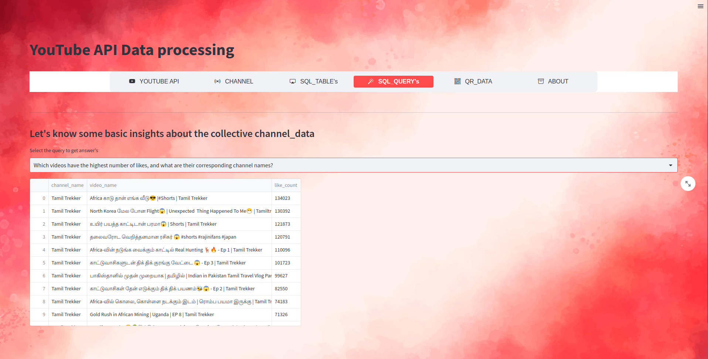
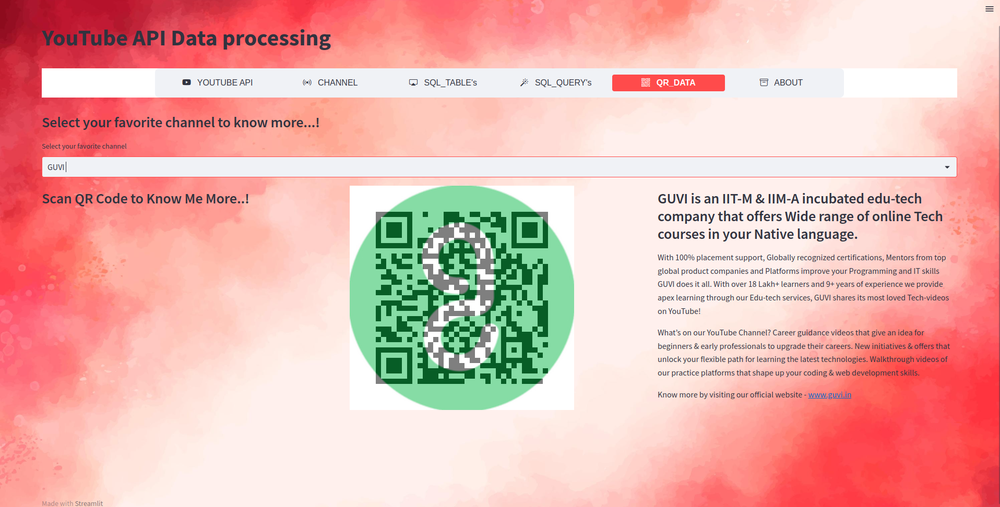

<h1 align="center">YOUTUBE - API</h1>


## Description

Fetching youtube channel data's via API and make store in MongoDB and make it in a Structured way to analyse it in faster way using SQLITE3 and to create this using a web-interface dynamic streamlit applictaion and make answer some query's


## Deployment

To deploy this project run

```bash
from googleapiclient.discovery import build
import streamlit as st
from streamlit_option_menu import option_menu
from streamlit_lottie import st_lottie
import pymongo
import datetime
import base64
from PIL import Image
import pandas as pd
import json
import sqlite3
import requests
import qrcode
from io import BytesIO
```
# Youtube - API
To connect with youtube API via API_KEY and build library and get the required parameter resource from youtube data 
```
API_KEY = 'YOUR_API_KEY'
youtube = build('youtube', 'v3', developerKey=API_KEY)
```
# Stramlit Interface


## Screenshots




# MongoDB Atlas

## Unstructured Data


# SQLITE3

## Structuring four diffrent table




# SQLITE3 - Query

## Query from SQLite3 table




# QRCODE

## Generating QRcode for corresponding channel's 




## Support

For support, email danavasanth@gmail.com


